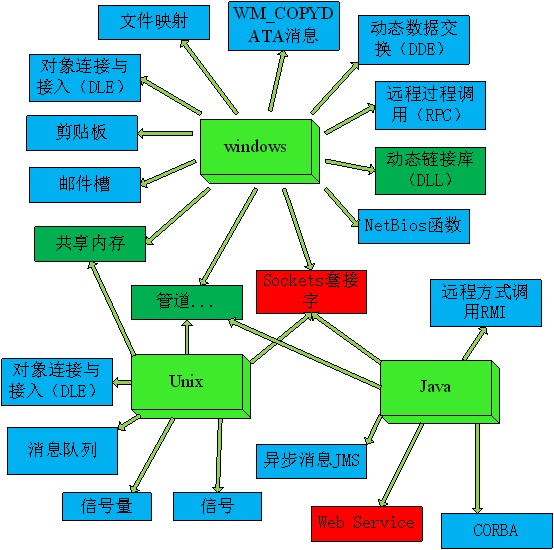
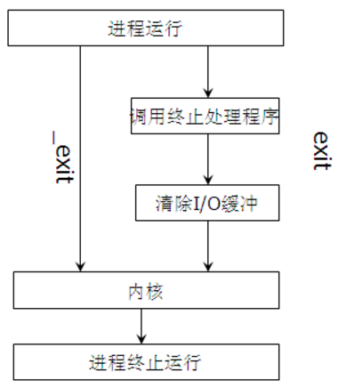
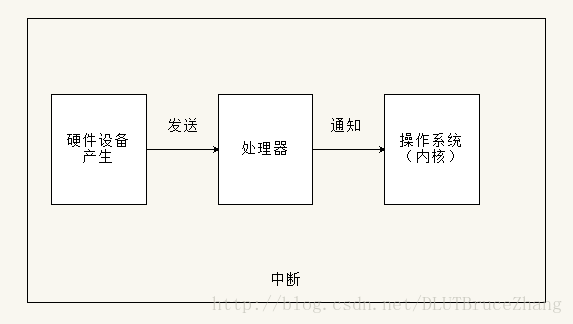
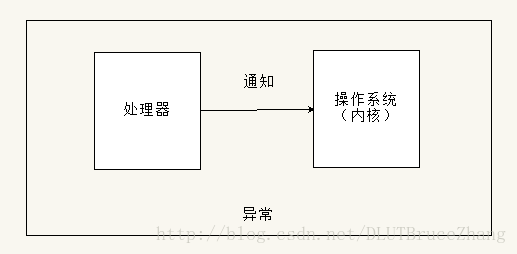

## 操作系统常见面试问题

### 1. 进程与线程的区别和联系

（1）调度：线程切换不会引起进程切换，不同进程中的线程切换则会引起进程切换。
（2）拥有资源：进程是拥有资源的基本单位，线程只拥有一点必不可少的资源， 但线程可以共享其隶属进程的系统资源。
（3）并发性：在引入线程的操作系统中，不仅进程可以并发执行，而且同进程内的多个线程也以并发执行，从而使操作系统具有更好的并发性，人大提高了系统吞吐量。
（4）系统开销：创建和撤销进程时，系统都要为之分配或回收资源，如内存空间、I/O设备等，因燥作系统所付出的开销远大于创建或撤销线程的开销。类似地，在进程切换时， 涉及当前执行进程CPU环境的保存以及新调度的进程CPU环境的设置，而线程切换时只需保存和设置少量寄存器内容，因此开销很小。另外，由于同一进程内的多 个线程共享进程的地址空间，因此这些线程之间的同步与通信比较容易实现，甚至无须操作系统的干预。
（5）地址空间和其他资源(如打开的文件)：进程的地址空间之间互相独立，同一进程的各线程间共亨进程的资源，某进程内的线程对于其他进程不可见。
（6）通信方面：进程间通信需要借助操作系统，而线程间可以直接读写进程数据段(如全局变量)来进行通信。

### 2. 一个进程可以创建多少线程，和什么有关

理论上，一个进程可用虚拟空间是2G，默认情况下，线程的栈的大小是1MB，所以理论上最多只能创建2048个线程。如果要创建多于2048的话，必须修改编译器的设置。

因此，一个进程可以创建的线程数由可用虚拟空间和线程的栈的大小共同决定，只要虚拟空间足够，那么新线程的建立就会成功。如果需要创建超过2K以上的线程，减小你线程栈的大小就可以实现了，虽然在一般情况下，你不需要那么多的线程。过多的线程将会导致大量的时间浪费在线程切换上，给程序运行效率带来负面影响。

> 《个进程到底能创建多少线程》：https://www.cnblogs.com/Leo_wl/p/5969621.html

### 3. 一个程序从开始运行到结束的完整过程

四个过程：

**（1）预编译**
主要处理源代码文件中的以“#”开头的预编译指令。处理规则见下
1、删除所有的#define，展开所有的宏定义。
2、处理所有的条件预编译指令，如“#if”、“#endif”、“#ifdef”、“#elif”和“#else”。
3、处理“#include”预编译指令，将文件内容替换到它的位置，这个过程是递归进行的，文件中包含其他
文件。
4、删除所有的注释，“//”和“/**/”。
5、保留所有的#pragma 编译器指令，编译器需要用到他们，如：#pragma once 是为了防止有文件被重
复引用。
6、添加行号和文件标识，便于编译时编译器产生调试用的行号信息，和编译时产生编译错误或警告是
能够显示行号。

**（2）编译**
把预编译之后生成的xxx.i或xxx.ii文件，进行一系列词法分析、语法分析、语义分析及优化后，生成相应
的汇编代码文件。
1、词法分析：利用类似于“有限状态机”的算法，将源代码程序输入到扫描机中，将其中的字符序列分
割成一系列的记号。
2、语法分析：语法分析器对由扫描器产生的记号，进行语法分析，产生语法树。由语法分析器输出的
语法树是一种以表达式为节点的树。
3、语义分析：语法分析器只是完成了对表达式语法层面的分析，语义分析器则对表达式是否有意义进
行判断，其分析的语义是静态语义——在编译期能分期的语义，相对应的动态语义是在运行期才能确定
的语义。
4、优化：源代码级别的一个优化过程。
5、目标代码生成：由代码生成器将中间代码转换成目标机器代码，生成一系列的代码序列——汇编语言
表示。
6、目标代码优化：目标代码优化器对上述的目标机器代码进行优化：寻找合适的寻址方式、使用位移
来替代乘法运算、删除多余的指令等。
**（3）汇编**
将汇编代码转变成机器可以执行的指令(机器码文件)。 汇编器的汇编过程相对于编译器来说更简单，没
有复杂的语法，也没有语义，更不需要做指令优化，只是根据汇编指令和机器指令的对照表一一翻译过
来，汇编过程有汇编器as完成。经汇编之后，产生目标文件(与可执行文件格式几乎一样)xxx.o(Linux
下)、xxx.obj(Windows下)。
**（4）链接**
将不同的源文件产生的目标文件进行链接，从而形成一个可以执行的程序。链接分为静态链接和动态链
接：
1、静态链接：
函数和数据被编译进一个二进制文件。在使用静态库的情况下，在编译链接可执行文件时，链接器从库
中复制这些函数和数据并把它们和应用程序的其它模块组合起来创建最终的可执行文件。
空间浪费：因为每个可执行程序中对所有需要的目标文件都要有一份副本，所以如果多个程序对同一个
目标文件都有依赖，会出现同一个目标文件都在内存存在多个副本；
更新困难：每当库函数的代码修改了，这个时候就需要重新进行编译链接形成可执行程序。
运行速度快：但是静态链接的优点就是，在可执行程序中已经具备了所有执行程序所需要的任何东西，
在执行的时候运行速度快。
2、动态链接：
动态链接的基本思想是把程序按照模块拆分成各个相对独立部分，在程序运行时才将它们链接在一起形
成一个完整的程序，而不是像静态链接一样把所有程序模块都链接成一个单独的可执行文件。
共享库：就是即使需要每个程序都依赖同一个库，但是该库不会像静态链接那样在内存中存在多分，副
本，而是这多个程序在执行时共享同一份副本；
更新方便：更新时只需要替换原来的目标文件，而无需将所有的程序再重新链接一遍。当程序下一次运
行时，新版本的目标文件会被自动加载到内存并且链接起来，程序就完成了升级的目标。
性能损耗：因为把链接推迟到了程序运行时，所以每次执行程序都需要进行链接，所以性能会有一定损
失。

> 《操作系统（三）》：https://www.nowcoder.com/tutorial/93/675fd4af3ab34b2db0ae650855aa52d5

### 4. 进程通信方法（Linux和windows下），线程通信方法（Linux和windows下）

**进程通信方法**



| 名称及方式                                                   |
| ------------------------------------------------------------ |
| 管道(pipe)：允许一个进程和另一个与它有共同祖先的进程之间进行通信 |
| 命名管道(FIFO)：类似于管道，但是它可以用于任何两个进程之间的通信，命名管道在文件系统中有对应的文件名。命名管道通过命令mkfifo或系统调用mkfifo来创建 |
| 消息队列(MQ)：消息队列是消息的连接表，包括POSIX消息对和System V消息队列。有足够权限的进程可以向队列中添加消息，被赋予读权限的进程则可以读走队列中的消息。消息队列克服了信号承载信息量少，管道只能成该无格式字节流以及缓冲区大小受限等缺点； |
| 信号量(semaphore)：信号量主要作为进程间以及同进程不同线程之间的同步手段； |
| 共享内存(shared memory)：它使得多个进程可以访问同一块内存空间，是最快的可用IPC形式。这是针对其他通信机制运行效率较低而设计的。它往往与其他通信机制，如信号量结合使用，以达到进程间的同步及互斥 |
| 信号(signal)：信号是比较复杂的通信方式，用于通知接收进程有某种事情发生，除了用于进程间通信外，进程还可以发送信号给进程本身 |
| 内存映射(mapped memory)：内存映射允许任何多个进程间通信，每一个使用该机制的进程通过把一个共享的文件映射到自己的进程地址空间来实现它 |
| Socket：它是更为通用的进程间通信机制，可用于不同机器之间的进程间通信 |

**线程通信方法**


| 名称及含义                                                   |
| ------------------------------------------------------------ |
| 信号：类似进程间的信号处理                                   |
| 锁机制：互斥锁、读写锁和自旋锁                               |
| 条件变量：使用通知的方式解锁，与互斥锁配合使用               |
| 信号量：包括无名线程信号量和命名线程信号量                   |
| 全局变量：需要有多个线程来访问一个全局变量时，通常我们会在这个全局变量前加上volatile声明，以防编译器对此变量进行优化 |
| Message消息机制：常用的Message通信的接口主要有两个：PostMessage和PostThreadMessage，PostMessage为线程向主窗口发送消息。而PostThreadMessage是任意两个线程之间的通信接口。 |
| CEvent对象：CEvent为MFC中的一个对象，可以通过对CEvent的触发状态进行改变，从而实现线程间的通信和同步，这个主要是实现线程直接同步的一种方法。 |

### 5. 文件读写使用的系统调用

### 6. 怎么回收线程

### 7. 终端退出终端运行的进程会怎样

终端在退出时会发送SIGHUP给对应的bash进程，bash进程收到这个信号后首先将它发给session下面的进程，如果程序没有对SIGHUP信号做特殊处理，那么进程就会随着终端关闭而退出

> 《linux终端关闭时为什么会导致在其上启动的进程退出？》：https://blog.csdn.net/QFire/article/details/80112701

### 8. 如何让进程后台运行

（1）命令后面加上&即可，实际上，这样是将命令放入到一个作业队列中了

（2）ctrl + z 挂起进程，使用jobs查看序号，在使用bg %序号后台运行进程

（3）nohup + &，将标准输出和标准错误缺省会被重定向到 nohup.out 文件中，忽略所有挂断（SIGHUP）信号

（4）运行指令前面 + setsid，使其父进程编程init进程，不受HUP信号的影响

（5）将 命令+ &放在()括号中，也可以是进程不受HUP信号的影响

### 9. 守护进程、僵尸进程和孤儿进程

**守护进程**

指在后台运行的，没有控制终端与之相连的进程。它独立于控制终端，周期性地执行某种任务。Linux的大多数服务器就是用守护进程的方式实现的。如web服务器进程http等

创建守护进程要点：

（1）让程序在后台执行。方法是调用fork（）产生一个子进程，然后使父进程退出。

（2）调用setsid（）创建一个新对话期。控制终端、登录会话和进程组通常是从父进程继承下来的，守护进程要摆脱它们，不受它们的影响，方法是调用setsid（）使进程成为一个会话组长。setsid（）调用成功后，进程成为新的会话组长和进程组长，并与原来的登录会话、进程组和控制终端脱离。

（3）禁止进程重新打开控制终端。经过以上步骤，进程已经成为一个无终端的会话组长，但是它可以重新申请打开一个终端。为了避免这种情况发生，可以通过使进程不再是会话组长来实现。再一次通过fork（）创建新的子进程，使调用fork的进程退出。

（4）关闭不再需要的文件描述符。子进程从父进程继承打开的文件描述符。如不关闭，将会浪费系统资源，造成进程所在的文件系统无法卸下以及引起无法预料的错误。首先获得最高文件描述符值，然后用一个循环程序，关闭0到最高文件描述符值的所有文件描述符。

（5）将当前目录更改为根目录。

（6）子进程从父进程继承的文件创建屏蔽字可能会拒绝某些许可权。为防止这一点，使用unmask（0）将屏蔽字清零。

（7）处理SIGCHLD信号。对于服务器进程，在请求到来时往往生成子进程处理请求。如果子进程等待父进程捕获状态，则子进程将成为僵尸进程（zombie），从而占用系统资源。如果父进程等待子进程结束，将增加父进程的负担，影响服务器进程的并发性能。在Linux下可以简单地将SIGCHLD信号的操作设为SIG_IGN。这样，子进程结束时不会产生僵尸进程。

**孤儿进程**

如果父进程先退出，子进程还没退出那么子进程的父进程将变为init进程。（注：任何一个进程都必须有父进程）

**僵尸进程**

如果子进程先退出，父进程还没退出，那么子进程必须等到父进程捕获到了子进程的退出状态才真正结束，否则这个时候子进程就成为僵尸进程。

设置**僵尸进程的目**的是维护子进程的信息，以便父进程在以后某个时候获取。这些信息至少包括进程ID，进程的终止状态，以及该进程使用的CPU时间，所以当终止子进程的父进程调用wait或waitpid时就可以得到这些信息。如果一个进程终止，而该进程有子进程处于僵尸状态，那么它的所有僵尸子进程的父进程ID将被重置为1（init进程）。继承这些子进程的init进程将清理它们（也就是说init进程将wait它们，从而去除它们的僵尸状态）。

**如何避免僵尸进程？**

- 通过signal(SIGCHLD, SIG_IGN)通知内核对子进程的结束不关心，由内核回收。如果不想让父进程挂起，可以在父进程中加入一条语句：signal(SIGCHLD,SIG_IGN);表示父进程忽略SIGCHLD信号，该信号是子进程退出的时候向父进程发送的。

- 父进程调用wait/waitpid等函数等待子进程结束，如果尚无子进程退出wait会导致父进程阻塞。waitpid可以通过传递WNOHANG使父进程不阻塞立即返回。
- 如果父进程很忙可以用signal注册信号处理函数，在信号处理函数调用wait/waitpid等待子进程退出。
- 通过两次调用fork。父进程首先调用fork创建一个子进程然后waitpid等待子进程退出，子进程再fork一个孙进程后退出。这样子进程退出后会被父进程等待回收，而对于孙子进程其父进程已经退出所以孙进程成为一个孤儿进程，孤儿进程由init进程接管，孙进程结束后，init会等待回收。

第一种方法忽略SIGCHLD信号，这常用于并发服务器的性能的一个技巧因为并发服务器常常fork很多子进程，子进程终结之后需要服务器进程去wait清理资源。如果将此信号的处理方式设为忽略，可让内核把僵尸子进程转交给init进程去处理，省去了大量僵尸进程占用系统资源。

> 《Linux系统下创建守护进程(Daemon)》：https://blog.csdn.net/linkedin_35878439/article/details/81288889
>
> 《01_fork()的使用》：https://blog.csdn.net/WUZHU2017/article/details/81636851

### 10. 父进程、子进程、进程组、作业和会话

**父进程**

已创建一个或多个子进程的进程

**子进程**

由fork创建的新进程被称为子进程（child process）。该函数被调用一次，但返回两次。两次返回的区别是子进程的返回值是0，而父进程的返回值则是新进程（子进程）的进程 id。将子进程id返回给父进程的理由是：因为一个进程的子进程可以多于一个，没有一个函数使一个进程可以获得其所有子进程的进程id。对子进程来说，之所以fork返回0给它，是因为它随时可以调用getpid()来获取自己的pid；也可以调用getppid()来获取父进程的id。(进程id 0总是由交换进程使用，所以一个子进程的进程id不可能为0 )。

fork之后，操作系统会复制一个与父进程完全相同的子进程，虽说是父子关系，但是在操作系统看来，他们更像兄弟关系，这2个进程共享代码空间，但是数据空间是互相独立的，子进程数据空间中的内容是父进程的完整拷贝，指令指针也完全相同，子进程拥有父进程当前运行到的位置（两进程的程序计数器pc值相同，也就是说，子进程是从fork返回处开始执行的），但有一点不同，如果fork成功，子进程中fork的返回值是0，父进程中fork的返回值是子进程的进程号，如果fork不成功，父进程会返回错误。

子进程从父进程继承的有：1.进程的资格(真实(real)/有效(effective)/已保存(saved)用户号(UIDs)和组号(GIDs))2.环境(environment)3.堆栈4.内存5.进程组号

独有：1.进程号；2.不同的父进程号(译者注：即子进程的父进程号与父进程的父进程号不同， 父进程号可由getppid函数得到)；3.资源使用(resource utilizations)设定为0

**进程组**

程组就是多个进程的集合，其中肯定有一个组长，其进程PID等于进程组的PGID。只要在某个进程组中一个进程存在，该进程组就存在，这与其组长进程是否终止无关。

**作业**

shell分前后台来控制的不是进程而是作业（job）或者进程组（Process Group）。一个前台作业可以由多个进程组成，一个后台也可以由多个进程组成，shell可以运行一个前台作业和任意多个后台作业，这称为作业控制

`为什么只能运行一个前台作业？` 
答：当我们在前台新起了一个作业，shell就被提到了后台，因此shell就没有办法再继续接受我们的指令并且解析运行了。 但是如果前台进程退出了，shell就会有被提到前台来，就可以继续接受我们的命令并且解析运行。

作业与进程组的区别：如果作业中的某个进程有创建了子进程，则该子进程是不属于该作业的。 
一旦作业运行结束，shell就把自己提到前台（子进程还存在，但是子进程不属于作业），如果原来的前台进程还存在（这个子进程还没有终止），他将自动变为后台进程组

**会话**

会话（Session）是一个或多个进程组的集合。一个会话可以有一个控制终端。在xshell中打开一个窗口就是新建一个会话

### 11. 进程终止的几种方式

1、main函数的自然返回，`return` 
2、调用`exit`函数，属于c的函数库
3、调用`_exit`函数，属于系统调用
4、调用`abort`函数，异常程序终止，同时发送SIGABRT信号给调用进程。 
5、接受能导致进程终止的信号：ctrl+c (^C)、SIGINT(SIGINT中断进程) 

**exit和_exit的区别**



> 《[学习笔记\]进程终止的5种方式》：https://www.cnblogs.com/shichuan/p/4432503.html

### 12. Linux中异常和中断的区别

**中断**

大家都知道，当我们在敲击键盘的同时就会产生中断，当硬盘读写完数据之后也会产生中断，所以，我们需要知道，中断是由硬件设备产生的，而它们从物理上说就是电信号，之后，它们通过中断控制器发送给CPU，接着CPU判断收到的中断来自于哪个硬件设备（这定义在内核中），最后，由CPU发送给内核，有内核处理中断。下面这张图显示了中断处理的流程：



**异常**

我们在学习《计算机组成原理》的时候会知道两个概念，CPU处理程序的时候一旦程序不在内存中，会产生缺页异常；当运行除法程序时，当除数为0时，又会产生除0异常。所以，大家也需要记住的是，异常是由CPU产生的，同时，它会发送给内核，要求内核处理这些异常，下面这张图显示了异常处理的流程：



**相同点**

- 最后都是由CPU发送给内核，由内核去处理

- 处理程序的流程设计上是相似的

**不同点**

- 产生源不相同，异常是由CPU产生的，而中断是由硬件设备产生的

- 内核需要根据是异常还是中断调用不同的处理程序

- 中断不是时钟同步的，这意味着中断可能随时到来；异常由于是CPU产生的，所以它是时钟同步的

- 当处理中断时，处于中断上下文中；处理异常时，处于进程上下文中

> 《Linux内核--异常和中断的区别》：https://blog.csdn.net/u011068464/article/details/10284741

### 13. 一般情况下在Linux/windows平台下栈空间的大小

**Linux**

linux下非编译器决定栈大小，而是由操作系统环境决定，默认是8192KB（8M）；而在Windows平台下栈的大小是被记录在可执行文件中的（由编译器来设置)，即：windows下可以由编译器决定栈大小，而在Linux下是由系统环境变量来控制栈的大小的。

 在Linux下通过如下命令可查看和设置栈的大小：

```shell
$ ulimit -a            # 显示当前栈的大小 （ulimit为系统命令，非编译器命令）       
$ ulimit -s 32768      # 设置当前栈的大小为32M
```
**Windows**

下程序栈空间的大小，VC++ 6.0 默认的栈空间是1M。


VC6.0中修改堆栈大小的方法：

- 选择 "Project->Setting"
- 选择 "Link"
- 选择 "Category"中的 "Output"
- 在 "Stack allocations"中的"Reserve:"中输栈的大小

> 《Linux/windows栈大小》：https://blog.csdn.net/HQ354974212/article/details/76087676

### 14. 程序从堆中动态分配内存时，虚拟内存上怎么操作的

页表：是一个存放在物理内存中的数据结构，它记录了虚拟页与物理页的映射关系

在进行动态内存分配时，例如malloc()函数或者其他高级语言中的new关键字，操作系统会在硬盘中创建或申请一段虚拟内存空间，并更新到页表（分配一个页表条目（PTE），使该PTE指向硬盘上这个新创建的虚拟页），通过PTE建立虚拟页和物理页的映射关系。

### 15. 交换空间与虚拟内存的关系

**交换空间**
Linux 中的交换空间（Swap space）在物理内存（RAM）被充满时被使用。如果系统需要更多的内存资源，而物理内存已经充满，内存中不活跃的页就会被移到交换空间去。虽然交换空间可以为带有少量内存的机器提供帮助，但是这种方法不应该被当做是对内存的取代。交换空间位于硬盘驱动器上，它比进入物理内存要慢。 
交换空间可以是一个专用的交换分区（推荐的方法），交换文件，或两者的组合。 
交换空间的总大小应该相当于你的计算机内存的两倍和 32 MB这两个值中较大的一个，但是它不能超过 2048MB（2 GB）。 
**虚拟内存**
虚拟内存是文件数据交叉链接的活动文件。是WINDOWS目录下的一个"WIN386.SWP"文件，这个文件会不断地扩大和自动缩小。 
就速度方面而言,CPU的L1和L2缓存速度最快，内存次之，硬盘再次之。但是虚拟内存使用的是硬盘的空间，为什么我们要使用速度最慢的硬盘来做 为虚拟内存呢？因为电脑中所有运行的程序都需要经过内存来执行，如果执行的程序很大或很多，就会导致我们只有可怜的256M/512M内存消耗殆尽。而硬盘空间动辄几十G上百G，为了解决这个问题，Windows中运用了虚拟内存技术，即拿出一部分硬盘空间来充当内存使用。 

> 《交换空间和虚拟内存的区别》：https://blog.csdn.net/qsd007/article/details/1567955

### 16. 从堆和栈上建立对象哪个快？（考察堆和栈的分配效率比较）

从两方面来考虑：

- 分配和释放，堆在分配和释放时都要调用函数（malloc,free)，比如分配时会到堆空间去寻找足够大小的空间（因为多次分配释放后会造成内存碎片），这些都会花费一定的时间，具体可以看看malloc和free的源代码，函数做了很多额外的工作，而栈却不需要这些。

- 访问时间，访问堆的一个具体单元，需要两次访问内存，第一次得取得指针，第二次才是真正得数据，而栈只需访问一次。另外，堆的内容被操作系统交换到外存的概率比栈大，栈一般是不会被交换出去的。

### 17. 常见内存分配方式和错误

**内存分配方式**

（1） 从静态存储区域分配。内存在程序编译的时候就已经分配好，这块内存在程序的整个运行期间都存在。例如全局变量，static变量。

（2） 在栈上创建。在执行函数时，函数内局部变量的存储单元都可以在栈上创建，函数执行结束时这些存储单元自动被释放。栈内存分配运算内置于处理器的指令集中，效率很高，但是分配的内存容量有限。

（3） 从堆上分配，亦称动态内存分配。程序在运行的时候用malloc或new申请任意多少的内存，程序员自己负责在何时用free或delete释放内存。动态内存的生存期由我们决定，使用非常灵活，但问题也最多。

**内存错误**

（1）内存分配未成功，却使用了它。

编程新手常犯这种错误，因为他们没有意识到内存分配会不成功。常用解决办法是，在使用内存之前检查指针是否为NULL。如果指针p是函数的参数，那么在函数的入口处用assert(p!=NULL)进行检查。如果是用malloc或new来申请内存，应该用if(p==NULL) 或if(p!=NULL)进行防错处理。

（2）内存分配虽然成功，但是尚未初始化就引用它。

犯这种错误主要有两个起因：一是没有初始化的观念；二是误以为内存的缺省初值全为零，导致引用初值错误（例如数组）。内存的缺省初值究竟是什么并没有统一的标准，尽管有些时候为零值，我们宁可信其无不可信其有。所以无论用何种方式创建数组，都别忘了赋初值，即便是赋零值也不可省略，不要嫌麻烦。

（3）内存分配成功并且已经初始化，但操作越过了内存的边界。

例如在使用数组时经常发生下标“多1”或者“少1”的操作。特别是在for循环语句中，循环次数很容易搞错，导致数组操作越界。

（4）忘记了释放内存，造成内存泄露。

含有这种错误的函数每被调用一次就丢失一块内存。刚开始时系统的内存充足，你看不到错误。终有一次程序突然挂掉，系统出现提示：内存耗尽。动态内存的申请与释放必须配对，程序中malloc与free的使用次数一定要相同，否则肯定有错误（new/delete同理）。

（5）释放了内存却继续使用它。常见于以下有三种情况：

- 程序中的对象调用关系过于复杂，实在难以搞清楚某个对象究竟是否已经释放了内存，此时应该重新设计数据结构，从根本上解决对象管理的混乱局面。

- 函数的return语句写错了，注意不要返回指向“栈内存”的“指针”或者“引用”，因为该内存在函数体结束时被自动销毁。

- 使用free或delete释放了内存后，没有将指针设置为NULL。导致产生“野指针”。

> 《内存分配方式及常见错误》：https://www.cnblogs.com/skynet/archive/2010/12/03/1895045.html

* [可重入函数和可重入内核](https://blog.csdn.net/chj1234chj/article/details/78162443?locationNum=7&fps=1)
* 操作系统动态内存分配的几种策略
* 内部碎片和外部碎片
* 系统调用进入内核态的过程
* 内核态和用户态的区别
* 常见的进程调度算法以及linux的进程调度
* 中断、陷阱、故障和终止
* 进程通信方法

> 同步进程通信：管道、FIFO（命名管道）、消息队列、共享内存、信号量（用于进程同步）、socket套接字
>
> 异步进程通信：信号

* 线程互斥和同步的方法

> 互斥：互斥量、读写锁、自旋锁
>
> 同步：轮询结合互斥量、条件变量、信号量、屏障
> 

* 内存对齐的规则和作用
* 页面置换算法

> 最佳
>
> 最近最久未使用（LRU）
>
> 最近未使用（NRU）
>
> 先进先出（FIFO）
>
> 第二次机会算法
>
> 时钟算法

- 实现一个LRU页置换算法（或者FIFO置换算法）
- 死锁的必要条件（怎么检测死锁，解决死锁问题）,银行家算法（死锁避免）
- 哲学家就餐，读者写者，生产者消费者（怎么加锁解锁，伪代码）
- 海量数据的bitmap使用原理
- 布隆过滤器原理与优点
- 布隆过滤器处理大规模问题时的持久化，包括内存大小受限、磁盘换入换出问题